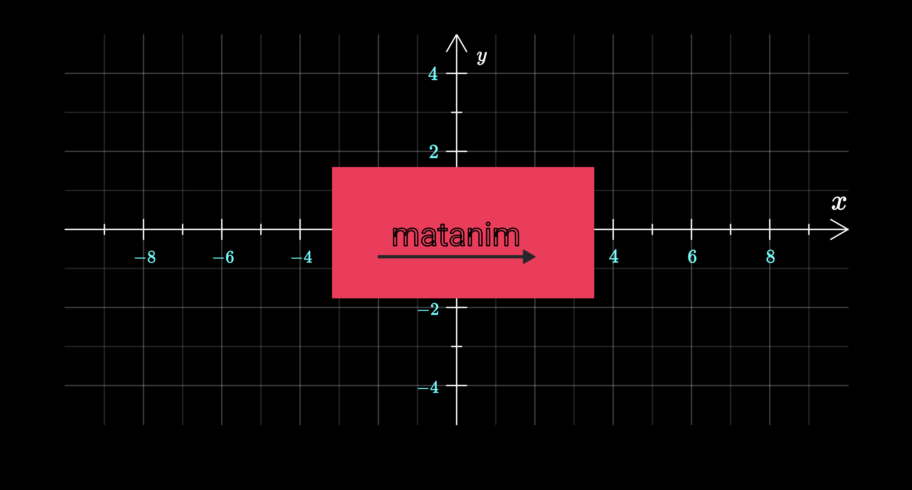

# MatAnim – Mathematical Animation Library

A lightweight JavaScript library for creating engaging mathematical animations and visualizations for educational purposes. Perfect for teachers, students, and anyone looking to make math concepts come alive through interactive visualizations.



---

## ✨ Features

- **Canvas-based rendering** – Smooth 60fps animations
- **Mathematical objects** – Coordinate systems, function plots, vectors, and more
- **Character animation** – Animated Pi character with facial expressions
- **LaTeX support** – Render mathematical expressions directly
- **Easing functions** – Multiple easing functions for natural motion
- **Flexible animation system** – Combine multiple animations seamlessly

---

## 📦 Installation

### npm

```bash
npm install matanim
```

### Browser (ES Modules)

```html
<!DOCTYPE html>
<html>
  <head>
    <style>
      html,
      body {
        margin: 0;
        padding: 0;
        width: 100%;
        height: 100%;
        overflow: hidden;
        background: black;
      }
      canvas {
        display: block;
        width: 100vw;
        height: 100vh;
      }
    </style>
  </head>
  <body>
    <canvas id="canvas"></canvas>

    <script type="importmap">
      {
        "imports": {
          "matanim": "./node_modules/matanim/src/index.js"
        }
      }
    </script>

    <script type="module" src="./src/main.js"></script>
  </body>
</html>
```

---

## 🚀 Quick Start

```javascript
import {
  Scene,
  Circle,
  AnimationManager,
  OutlineThanFillAnimation,
  CoordinateSystem,
  FunctionPlot,
  PiCharacter,
  TranslateAnimation,
  ScaleAnimation,
  easeInOutSine,
} from "matanim";

// Setup scene
const canvas = document.querySelector("canvas");
const scene = new Scene(canvas);

// Create a coordinate system
const coordinateSystem = new CoordinateSystem(
  [
    { x: 100, y: 300 },
    { x: 1300, y: 300 },
  ],
  [-10, 10],
  [-5, 5],
  {
    tickStep: 2,
    hasLabels: true,
    hasGrid: true,
    xAxisLabel: "x",
    yAxisLabel: "y",
  }
);

// Plot a function
const sineWave = new FunctionPlot(coordinateSystem, (x) => Math.sin(x), {
  lineWidth: 4,
  color: "#4cc9f0",
  dashed: true,
});

// Add a Pi character
const piCharacter = new PiCharacter([{ x: 100, y: 400 }]);

// Add objects to scene
scene.add(coordinateSystem);
scene.add(sineWave);
scene.add(piCharacter);

// Animate!
const animationManager = new AnimationManager(scene);

animationManager.add(
  new OutlineThanFillAnimation(coordinateSystem, {
    duration: 1500,
  })
);

animationManager.add(
  new TranslateAnimation(piCharacter, {
    delta: { x: 200, y: 0 },
    duration: 1000,
    easingFunction: easeInOutSine,
  })
);
```

---

## 📚 API Reference

### Core Classes

#### Scene

The main container for all graphical objects.

```javascript
const scene = new Scene(canvasElement);
scene.add(graphicalObject);
```

#### GraphicalObject

Base class for all graphical objects with transformation capabilities.

**Methods:**

- `translate(delta, notify = true)`
- `scale(xScale, yScale, pivot = getCenter(), notify = true)`
- `getCenter()`
- `getBoundingBox()`

---

## 📐 Graphical Objects

### Circle

```javascript
const circle = new Circle([{ x: 200, y: 200 }], 50, {
  fillColor: "red",
  borderColor: "white",
  lineWidth: 2,
});
```

### Rectangle

```javascript
const rect = new Rectangle([{ x: 100, y: 100 }], 200, 100, {
  fillColor: "blue",
  borderColor: "yellow",
});
```

### Line

```javascript
const line = new Line(
  [
    { x: 100, y: 100 },
    { x: 300, y: 300 },
  ],
  {
    lineWidth: 3,
    color: "green",
  }
);
```

### Text & MathText

```javascript
const text = new Text([{ x: 100, y: 100 }], "Hello World", {
  fontSize: 24,
  color: "white",
});

const mathText = new MathText([{ x: 100, y: 150 }], "f(x) = \\sin(x)", {
  fontSize: 32,
  fillColor: "#4cc9f0",
});
```

### CoordinateSystem

```javascript
const coordinateSystem = new CoordinateSystem(
  [
    { x: 100, y: 300 },
    { x: 1300, y: 300 },
  ],
  [-10, 10],
  [-5, 5],
  {
    tickStep: 2,
    hasLabels: true,
    hasGrid: true,
    xAxisLabel: "x",
    yAxisLabel: "y",
  }
);
```

### FunctionPlot

```javascript
const parabola = new FunctionPlot(coordinateSystem, (x) => x * x, {
  lineWidth: 3,
  color: "red",
  dashed: false,
});
```

### Vector

```javascript
const vector = new Vector(
  [coordinateSystem.pointToCoords(0, 0), coordinateSystem.pointToCoords(3, 2)],
  {
    color: "orange",
    lineWidth: 3,
  }
);
```

### PiCharacter

```javascript
const piCharacter = new PiCharacter([{ x: 100, y: 100 }]);
piCharacter.scale(0.5, 0.5);

piCharacter.leftEye;
piCharacter.rightEye;
```

### BubbleWithText

```javascript
const bubble = new BubbleWithText(
  [{ x: 200, y: 200 }],
  "Hello!\nThis is a speech bubble.",
  {
    fontSize: 16,
  }
);
```

### BezierCurve

```javascript
const curve = new BezierCurve(
  [
    { x: 100, y: 200 },
    { x: 200, y: 100 },
    { x: 300, y: 300 },
    { x: 400, y: 200 },
  ],
  {
    color: "white",
    fill: false,
  }
);
```

### Eye

Composite object used internally by `PiCharacter`, but also available for standalone usage.

```javascript
const eye = new Eye([{ x: 100, y: 100 }], {
  eyeDirectionDeg: 45,
  irisRadius: 10,
  pupileRadius: 2,
});
```

### NumberLine

Highly configurable number line with ticks, labels, arrows and rotation.

```javascript
const numberLine = new NumberLine(
  [
    { x: 100, y: 300 },
    { x: 600, y: 300 },
  ],
  [-5, 5],
  {
    tickStep: 1,
    hasGrid: false,
    label: "x",
  }
);
```

### MultiLineText

Supports mixed regular text and inline LaTeX expressions.

```javascript
const text = new MultiLineText(
  [{ x: 100, y: 100 }],
  "This is text with with\n multiple lines.",
  { fontSize: 24 }
);
```

---

## 🎞 Animation System

### AnimationManager

```javascript
const animationManager = new AnimationManager(scene);
animationManager.add(animation);
```

### Animation Types

#### OutlineThanFillAnimation

```javascript
new OutlineThanFillAnimation(object, {
  duration: 1000,
  toTop: false,
  strokeColor: "blue",
});
```

#### TranslateAnimation

```javascript
new TranslateAnimation(object, {
  delta: { x: 200, y: 100 },
  duration: 1000,
  easingFunction: easeInOutSine,
});
```

#### ScaleAnimation

```javascript
new ScaleAnimation(object, {
  xScale: 2,
  yScale: 2,
  center: object.getCenter(),
  duration: 1000,
  easingFunction: easeInOutElastic,
});
```

#### Fade Animations

```javascript
new FadeInAnimation(object, { duration: 1000 });
new FadeOutAnimation(object, { duration: 1000 });
```

---

## 🎭 Character Animations

```javascript
new SquintingEyeAnimation(eyeObject);
new UnSquintingEyeAnimation(eyeObject);

new WavingRightArmAnimation(piCharacter, {
  easingFunction: easeInOutBack,
  animationManager: animationManager,
});
```

---

## 📈 Easing Functions

MatAnim provides a rich set of easing functions:

- `easeInSine`
- `easeInOutSine`
- `easeInOutCirc`
- `easeInQuad`
- `easeInCubic`
- `easeInExpo`
- `easeInElastic`
- `easeOutElastic`
- `easeInOutElastic`
- `easeInBounce`
- `easeOutBounce`
- `easeInOutBounce`

```javascript
new TranslateAnimation(object, {
  delta: { x: 100, y: 0 },
  duration: 1000,
  easingFunction: easeInOutElastic,
});
```

---

## 🧪 Examples

### Animated Graph

```javascript
const coordinateSystem = new CoordinateSystem(
  [
    { x: 100, y: 350 },
    { x: 1300, y: 350 },
  ],
  [-Math.PI, Math.PI],
  [-2, 2],
  { hasGrid: true, hasLabels: true }
);

const sine = new FunctionPlot(coordinateSystem, (x) => Math.sin(x), {
  color: "#4cc9f0",
  lineWidth: 3,
});

const cosine = new FunctionPlot(coordinateSystem, (x) => Math.cos(x), {
  color: "#f72585",
  lineWidth: 3,
  dashed: true,
});

const piCharacter = new PiCharacter([{ x: 100, y: 400 }]);

setTimeout(() => {
  animationManager.add(
    new OutlineThanFillAnimation(coordinateSystem, { duration: 1500 })
  );
}, 500);

setTimeout(() => {
  animationManager.add(new OutlineThanFillAnimation(sine, { duration: 2000 }));
  animationManager.add(
    new OutlineThanFillAnimation(cosine, { duration: 2000 })
  );
}, 2500);
```

---

## 🌍 Browser Support

- Modern browsers with ES6 module support
- Canvas API required
- ❌ Internet Explorer not supported

---

## ❤️ Acknowledgments

- Designed for mathematics education
- Inspired by manim

> **Note:** MatAnim is designed for short, focused educational animations that clearly illustrate mathematical concepts.
